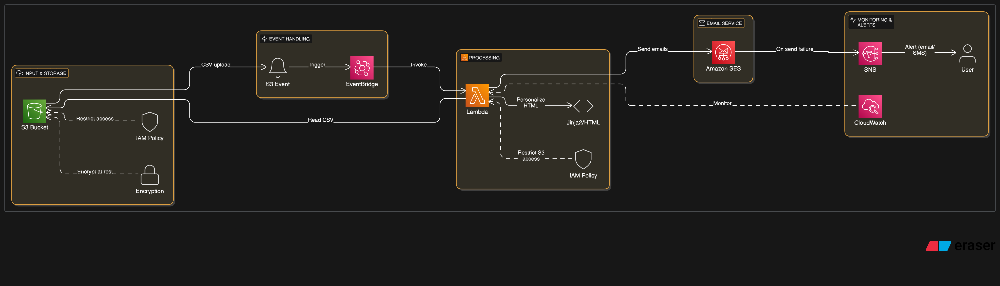
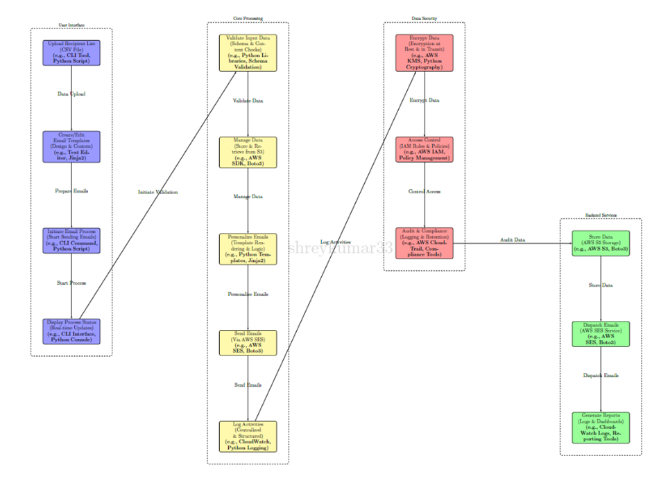
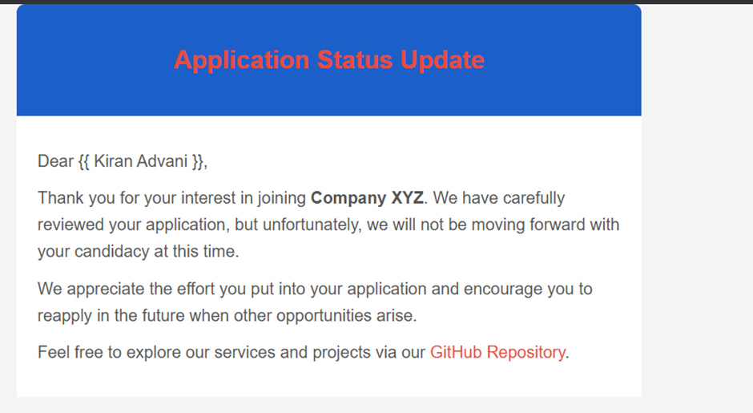
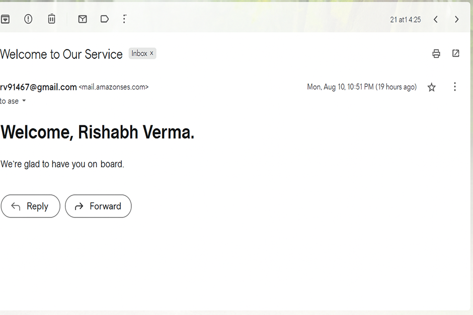

# Serverless Notification System: Bulk Email Notification System Using AWS Services

## Overview

Serverless Notification System is an automated bulk email notification system built with AWS serverless services. It allows users to upload CSV files containing recipient data, personalize email content, and dispatch bulk emails using Amazon SES. The system leverages AWS Lambda for processing, Amazon S3 for file storage, and monitoring and security services like CloudWatch and IAM to ensure seamless and secure operations. The architecture is designed to be fully scalable, cost-efficient, and customizable for real-world bulk mailing scenarios.

## Purpose and Motivation

Sending bulk emails efficiently and securely can be challenging, especially when managing large recipient lists, dynamic content personalization, and real-time monitoring of delivery status. Serverless Notification System addresses these challenges by utilizing AWS's serverless infrastructure to build a highly available, event-driven email notification system.

## Architecture 



## Project Workflow


1. **Upload CSV File**: A CSV file with recipient information (e.g., name, email) is uploaded to an Amazon S3 bucket.
2. **Event Trigger**: An S3 event triggers Amazon EventBridge, which in turn activates the AWS Lambda function.
3. **Data Processing**: Lambda processes the CSV file, validates the data, personalizes the email templates (using tools like Jinja2), and prepares them for dispatch.
4. **Email Dispatch**: Lambda sends the personalized emails using Amazon SES.
5. **Monitoring and Alerts**: CloudWatch monitors the Lambda function. If there’s an error, SNS sends an alert to the user via email or SMS.
6. **Security**: Data is encrypted at rest in S3 and in transit. IAM ensures proper role-based access control.

## How to Use

### Prerequisites

* AWS Account with permissions for SES, S3, Lambda, IAM, CloudWatch, SNS, and EventBridge.
* Familiarity with Python, AWS CLI, and basic knowledge of AWS services.
* Domain verified in SES for sending emails.

### Step-by-Step Setup

1. **Configure AWS CLI**: Ensure you have the AWS CLI installed and configured with your credentials.

2. **Create the S3 Bucket**: Create an S3 bucket where you will upload your CSV files containing recipient details.

   
   
   

4. **Deploy Lambda Function**: Upload your Lambda function code (Python) via the AWS Lambda console or CLI. Set up an S3 event trigger via EventBridge to invoke Lambda when a new file is uploaded.
   
   
   
   

5. **Configure CloudWatch and SNS**: Set up CloudWatch alarms to monitor Lambda's performance. Create an SNS topic to send notifications in case of errors.

   

   
   
   
   \#alarms deployment --

6. **IAM Roles and Permissions**: Assign a well-defined IAM role to your Lambda function with least-privilege permissions to access S3, SES, and CloudWatch.

   
   
   
 

7. **Test the System**: Upload a CSV file to the S3 bucket and verify that emails are sent to the recipients listed in the file. Monitor CloudWatch logs and ensure that any errors trigger alerts via SNS.
   
   
    
   ()
 

## Notes and Best Practices

1. **Never Hardcode AWS Credentials**: Use IAM roles and AWS environment variables for handling credentials. Hardcoding credentials in code is a security risk.
2. **Input Validation**: Always validate the data being uploaded, including checking the CSV structure and sanitizing input data to avoid vulnerabilities.
3. **Use IAM Roles with Least Privilege**: Assign only the necessary permissions to Lambda using IAM roles. Avoid granting broader permissions than required.
4. **Monitor Costs**: Since SES and Lambda are pay-per-use services, monitor usage to avoid unexpected billing spikes. Use AWS Budgets to set alerts.
5. **Email Limits in SES**: Ensure that your account has sufficient SES sending limits to handle the volume of emails. Start with verified emails in a sandbox environment.
6. **Error Handling**: Implement robust error handling within your Lambda function to gracefully manage failed email sends or unexpected data formats.
7. **Logging and Monitoring**: Regularly check CloudWatch logs for troubleshooting and ensure smooth operations. Set alarms for critical issues.

---

## Use Case(#01): Automated Bulk Sending of Offer and Rejection Letters with PDF Attachments


### Table of Contents

* [Introduction](#introduction)
* [Prerequisites](#prerequisites)
* [Folder Structure](#folder-structure)
* [Setup and Configuration](#setup-and-configuration)

  * [Step 1: Prepare the Recipient List](#step-1-prepare-the-recipient-list)
  * [Step 2: Customize the Lambda Function](#step-2-customize-the-lambda-function)
  * [Step 3: AWS Resource Configuration](#step-3-aws-resource-configuration)
* [Testing](#testing)
* [Conclusion](#conclusion)

### Directory Structure

```bash
use_case/
├── bulk_offer_rejection/
│   ├── recipient.csv                  # List of email recipients with offer/rejection status and corresponding attachment file names
│   ├── offer_letter_template.pdf       # Template for the offer letter to
```


be attached
│   ├── rejection\_letter\_template.pdf   # Template for the rejection letter to be attached
│   ├── lambda\_function.py             # Lambda function code to process CSV and send emails
│   └── README.md                     # Documentation for this use case

```

### recipient.csv Format

| email                | name       | status   | attachment             |
|----------------------|------------|----------|------------------------|
| candidate1@example.com | John Doe  | offered  | offer_letter_template.pdf |
| candidate2@example.com | Jane Smith | rejected | rejection_letter_template.pdf |

---

This approach demonstrates how you can personalize email sending workflows with attachments using the Serverless Notification System framework.

---

If you want, I can also help generate example Lambda function code snippets or help you understand any specific part of the system. Just let me know!
```
